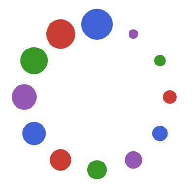

<!-- This file is generated by `.github/workflows/create_readme.yml` and should not be edited directly. -->

<div align="center">

<p></p>

# Speculator.jl

[](https://jakobjpeters.github.io/Speculator.jl/)
[](https://jakobjpeters.github.io/Speculator.jl/development/)

[](https://github.com/jakobjpeters/Speculator.jl/actions/workflows/continuous_integration.yml)
[](https://github.com/jakobjpeters/Speculator.jl/actions/workflows/documentation.yml)

[](https://codecov.io/gh/jakobjpeters/Speculator.jl)

</div>

## Introduction

Speculator.jl reduces latency by automatically searching for compilable methods.

## Usage

### Installation

```julia-repl
julia> using Pkg: add

julia> add("Speculator")

julia> using Speculator
```

### Showcase

```julia-repl
julia> module Showcase
           export g, h

           f() = nothing
           g(::Int) = nothing
           h(::Union{String, Symbol}) = nothing
       end;

julia> speculate(Showcase; verbosity = debug)
[ Info: Compiled `Main.Showcase.g(::Int)`
[ Info: Compiled `Main.Showcase.f()`

julia> speculate(Base.isexported, Showcase; verbosity = debug)
[ Info: Skipped `Main.Showcase.g(::Int)`

julia> speculate(Showcase.h; limit = 2, verbosity = debug)
[ Info: Compiled `Main.Showcase.h(::String)`
[ Info: Compiled `Main.Showcase.h(::Symbol)`

julia> install_speculator(; limit = 4, verbosity = debug)
[ Info: The input speculator has been installed into the REPL

julia> i(::Union{String, Symbol}, ::AbstractChar) = nothing;

[ Info: Compiled `Main.i(::Symbol, ::LinearAlgebra.WrapperChar)`
[ Info: Compiled `Main.i(::String, ::LinearAlgebra.WrapperChar)`
[ Info: Compiled `Main.i(::Symbol, ::Char)`
[ Info: Compiled `Main.i(::String, ::Char)`
```

## Features

- Precompile packages
- Compile interactively
- Filter values
- Run in the background
- Handle abstractly typed methods
- Save compilation directives to a file
- Show logging statements

### Planned

- Disable during development using Preferences.jl?
- Support for `UnionAll` types?

## Similar Packages

- [Cthulhu.jl](https://github.com/JuliaDebug/Cthulhu.jl)
- [CompileTraces.jl](https://github.com/serenity4/CompileTraces.jl)
- [JET.jl](https://github.com/aviatesk/JET.jl)
- [MethodAnalysis.jl](https://github.com/timholy/MethodAnalysis.jl)
- [PackageCompiler.jl](https://github.com/JuliaLang/PackageCompiler.jl)
- [PkgCacheInspector.jl](https://github.com/timholy/PkgCacheInspector.jl)
- [PrecompileSignatures.jl](https://github.com/rikhuijzer/PrecompileSignatures.jl)
- [PrecompileTools.jl](https://github.com/JuliaLang/PrecompileTools.jl)
- [SnoopCompile.jl](https://github.com/timholy/SnoopCompile.jl)
    - [SnoopCompileCore.jl](https://github.com/timholy/SnoopCompile.jl/tree/master/SnoopCompileCore)

## Acknowledgements

Credit to [Cameron Pfiffer](https://github.com/cpfiffer) for the initial idea.

The preexisting package PrecompileSignatures.jl implements similar functionality,
notably that `PrecompileSignatures.@precompile_signatures ::Module`
is roughly equivalent to `Speculator.speculate(::Module)`.

The idea to compile concrete method signatures has also been brought up in
[PrecompileTools.jl #28](https://github.com/JuliaLang/PrecompileTools.jl/issues/28).
